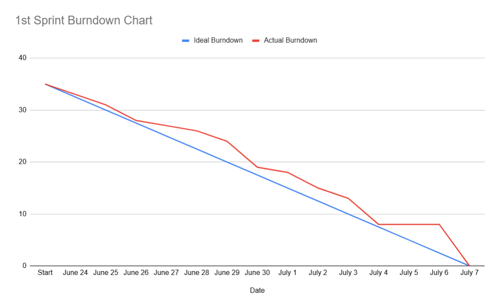
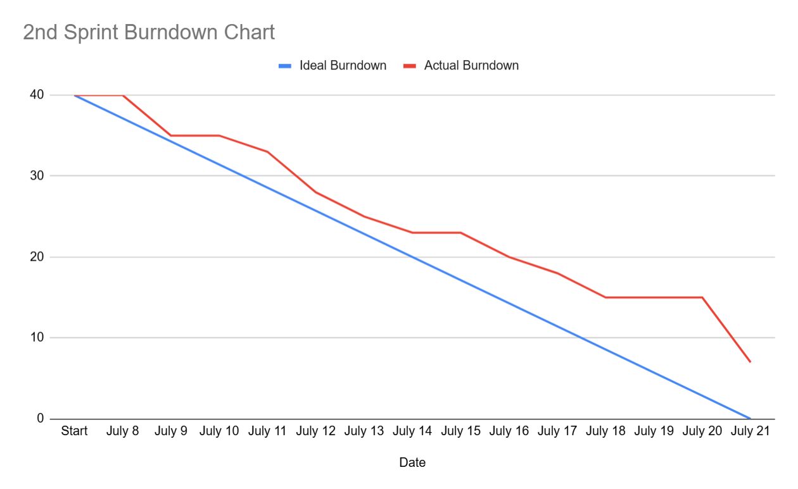

# **Team Name**
Unity Group-7

# Information About the Product

## Team Members
- **Aziz Önder**: *Scrum Master* / *Product Owner* / *Developer*
- **Beyza Özkan**: *Developer*
- **Aybaran Yurtseven**: *Developer*
- **Ayberk Yaşar**: *Developer*
  

## Product Name
### ***Animorph Odyssey***

## Product Backlog URL
### [**Unity Group-7 Trello URL**](https://trello.com/b/YsJvfJ2v/ouo-bootcamp-grup07)   

## Product Description

Embark on a thrilling interstellar adventure in "Animorph Odyssey"! Abducted by mysterious aliens, our protagonist discovers a unique tool that grants the power to transform into a beaver, turtle, monkey, and rabbit. Utilize these transformations to leverage each creature’s distinct abilities and solve intricate puzzles. Navigate through captivating alien environments, outwit your captors, and plot your daring escape from the depths of space.

## Product Features
- Immersive 3D Graphics
- Engaging Action-Adventure Gameplay
- Challenging Puzzles
- Unique Transformation Mechanics
- Various Level Designs

## Target Audiance
- Puzzle Enthusiasts
- Sci-Fi Fans
- Adventure Seekers
- Anyone who loves playing games

### Note to Jury
...
---

# Sprint 1

 

 <strong> Sprint board update screenshots </strong> 

  
- Initial Board:       
- 2nd Version:       
- End of The Sprint:     

 <strong> Product status screenshots </strong> 

  
- Human Model:         
- Monkey Model:         
- Rabbit Model:       
- Turtle Model:       
- Beaver Model:       
   
- In-game Screenshot-1:       
- In-game Screenshot-2:       
- In-game Screenshot-3:       

 

 <strong> Burndown Chart </strong> 

  
       

- **The points estimated to be completed during the sprint**: 35 Points

- **Point Completion Logic**: Around 100-110 points are estimated for the whole project . When divided into 3 sprints, it was decided that around 35 point should be completed in the 1st sprint.

- **Daily Scrum**: The Daily Scrum meetings were conducted through voice communication on Discord. When team members were not available, they communicated thier situations by text in Discord.  
 [Meeting Screenshots](https://imgur.com/a/lyRLkC5)   

- ### **Sprint Review**: 
    - Although we struggled to keep up with the ideal curve on the burndown chart, we managed to achieve our target points by the end of the sprint.
     - In this sprint, we completed the basics of:
        - Coding the main game mechanic of character transformation, including models and animations;
        - Scoring and mechanism for progressing to the next level;
        - Design of the tutorial level
    - Due to the religous holiday at the start of the bootcamp, we had difficulties communicating with team members and scheduling meetings at a convenient time for everyone, which slowed us down.
    - Initially, we planned for our character to transform into chameleon, mouse, monkey, and kangaroo/rabbit. However, due to the limited assets available in the bootcamp and the lack of a team member dedicated to design tasks, we decided to use turtle instead of chameleon, and beaver instead of mouse.
    - We encountered difficulties in adjusting the URP settings for the portal used to transition between levels.
    - Although we set up the level scoring system, we couldn’t test it comprehensively as only the tutorial level was ready.
    - Due to some differences in the Firebase system between desktop and Android, we decided to postpone Firebase rlated tasks to the second sprint.
    - Despite our lack of experience in 3D game development and the absence of a designer in the team, we managed to achieve our overall goals in this sprint.
    - **Sprint Review Participants:** `Aziz Önder`, `Ayberk Yaşar`, `Beyza Özkan`

- ### **Sprint Retrospective:**
    - Due to communication issues within the team, it was decided to create a WhatsApp group, in addition to the Discord server, to ensure more effective communication in the next sprint.
    - Due to the lack of a designer, it was decided that Ayberk and Aziz would work on finding suitable assets and level design.
    - It was emphasized that team members should be more active and open to communication in future sprints.

  

---

# Sprint 2

 

 <strong> Sprint board update screenshots </strong> 

  
- Initial Board:       
- 2nd Version:       
- End of The Sprint:     

 <strong> Product status screenshots </strong> 

  
- **Level Design:**
  
  - Level-1:   
         
         
              
  - Level-2:   
         
         
            
  - Level-3:   
         
         
                

- **Firebase**
  
       
       

 

 <strong> Burndown Chart </strong> 

  
      

- **The points estimated to be completed during the sprint**: 40 Points

- **Point Completion Logic**: After successfully completing the last sprint, we have 80 points remaining to finish the entire project. Therefore, our goal for this sprint is to complete 40 points (half of the remaining points).
  
- **Daily Scrum**: We tried to hold the Daily Scrum meetings via voice on Discord, but since some team members were unavailable, we mainly communicated through messages on Discord and WhatsApp.  
 [Meeting Screenshots](https://imgur.com/a/CDPMuYo)    

- ### **Sprint Review**:
    - We were unable to achieve our targeted points in this sprint due to several reasons:
        - The tasks we planned took longer than expected.
        - We needed to make changes to the backlog.
        - We encountered issues in the Github repository.
        - There were times when team members were busy, preventing us from holding frequent meetings. 
    - Aziz and Ayberk mainly focused on the design and structure of the levels. Initially, we planned to create 5 levels, but since it took longer than expected, we decided to reduce it to 3 levels.
    - Beyza was able to establish a Firebase connection and save the player's score to the database, but we didn't have enough time to integrate the Firebase system into every game level.
    - Aybaran completed the necessary tasks related to the enemies, but due to issues with the GitHub repository, we were unable to fully integrate the changes into the project. Additionally, while trying to merge enemy related branch, we caused bugs in the player input system which caused more work for the mext sprint.
    - Even though we established the necessary mechanics' infrastructure in this sprint, we were unable to fully integrate the changes into the game. Therefore, our first goal for the next sprint will be to fully merge all the changes made.
    - In the final sprint, we plan to focus on features such as user interfaces, enhancing existing mechanics, and adding visual and sound effects as well as other artistic content.
    - **Sprint Review Participants:** `Aziz Önder`, `Aybaran Yurtseven`, `Beyza Özkan`
      
- ### **Sprint Retrospective:**
    - Although we decided to create fewer levels than initially planned, the most successful aspect of this sprint for everyone was the level design.
    - The issues we faced with GitHub were the most detrimental factors affecting our performance in this sprint. Therefore, it has been decided that if any problems arise with the repository/merging, the two individuals working on the relevant branches will address and resolve these issues as quickly as possible.
    - In this sprint, due to the project manager's health issues, we were able to hold fewer meetings compared to the previous sprint, which negatively affected our performance. In the final sprint, we have decided to hold more frequent meetings to ensure effective communication.

    

---

# Sprint 3

- **Sprint içinde tamamlanması tahmin edilen puan**: 

- **Daily Scrum**:

- **Sprint board update**: Sprint board screenshotları: 

- **Ürün Durumu**: Ekran görüntüleri:

- **Sprint Review**: 

- **Sprint Retrospective:**

---
